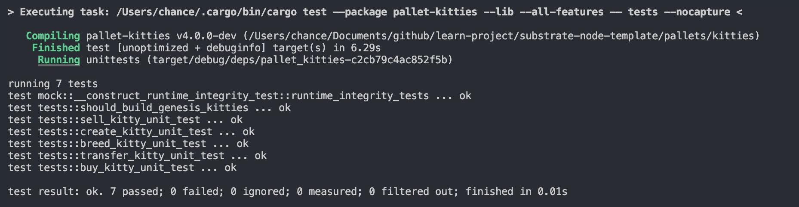

# 第二课作业


## 第一题: 增加买和卖的extrinsic，对视频中kitties的实现进行重构，提取出公共代码

### `#[pallet::call]`增加`sell_kitty`和`buy_kitty`方法，提取代码到`fn handle_kitty_exchange`用于处理交易相关业务。

```rust

/// Set the price for a Kitty.
///
/// Updates Kitty price and updates storage.
#[pallet::weight(100)]
pub fn sell_kitty(
	origin: OriginFor<T>,
	kitty_id: T::KittyIndex,
	new_price: Option<BalanceOf<T>>,
) -> DispatchResult {
	let sender = ensure_signed(origin)?;
	ensure!(Self::is_kitty_owner(&kitty_id, &sender)?, Error::<T>::NotKittyOwner);
	Self::handle_kitty_exchange(&kitty_id, &sender, None, new_price)
}

/// Buy a saleable Kitty. The bid price provided from the buyer has to be equal or higher
/// than the ask price from the seller.
///
/// This will reset the asking price of the kitty, marking it not for sale.
/// Marking this method `transactional` so when an error is returned, we ensure no storage
/// is changed.
#[transactional]
#[pallet::weight(100)]
pub fn buy_kitty(
	origin: OriginFor<T>,
	kitty_id: T::KittyIndex,
	bid_price: BalanceOf<T>,
) -> DispatchResult {
	let buyer = ensure_signed(origin)?;
	ensure!(!Self::is_kitty_owner(&kitty_id, &buyer)?, Error::<T>::BuyerIsKittyOwner);
	Self::handle_kitty_exchange(&kitty_id, &buyer, None, Some(bid_price))
}

#[transactional]
pub fn handle_kitty_exchange(
	kitty_id: &T::KittyIndex,
	who: &T::AccountId,
	to: Option<T::AccountId>,
	price: Option<BalanceOf<T>>,
) -> DispatchResult {
	Kitties::<T>::try_mutate(kitty_id, |maybe_kitty| {
		// Check the kitty exists
		let k = maybe_kitty.as_mut().ok_or(Error::<T>::KittyNotExist)?;
		//if order is exist check the price
		if &k.owner == who {
			if let Some(new_owner) = to {
				// Transfer kitty

				// Verify the kitty is not transferring back to its owner.
				ensure!(who != &new_owner, Error::<T>::TransferToSelf);

				// Move the deposit to the new owner.
				T::Currency::repatriate_reserved(
					&k.owner,
					&new_owner,
					k.deposit,
					BalanceStatus::Reserved,
				)?;

				// Update the kitty owner
				k.owner = new_owner.clone();
				// Reset the ask price so the kitty is not for sale until `set_price()` is
				// called by the current owner.
				k.price = None;

				<KittiesOwned<T>>::insert(kitty_id, new_owner.clone());

				Self::deposit_event(Event::Transferred(
					who.to_owned(),
					new_owner,
					kitty_id.to_owned(),
				));
			} else {
				// Owner set price of kitty

				// seller reset price
				k.price = price;
				// Deposit a "PriceSet" event.
				Self::deposit_event(Event::PriceSet(
					who.to_owned(),
					kitty_id.to_owned(),
					price,
				));
			}

			Ok(())
		} else {
			// Buy a kitty which on sale.

			let bid_price = price.ok_or(Error::<T>::NotKittyOwner)?;
			// Check the kitty is for sale and the kitty ask price <= bid_price
			if let Some(ask_price) = k.price {
				ensure!(ask_price <= bid_price, Error::<T>::KittyBidPriceTooLow);
			} else {
				Err(Error::<T>::KittyNotForSale)?;
			}

			// Move the deposit to the new owner.
			T::Currency::repatriate_reserved(
				&k.owner,
				who,
				k.deposit,
				BalanceStatus::Reserved,
			)?;

			// Check the buyer has enough free balance
			ensure!(
				T::Currency::free_balance(who) >= bid_price,
				Error::<T>::NotEnoughBalance
			);

			let seller = k.owner.clone();

			// Transfer the amount from buyer to seller
			T::Currency::transfer(
				who,
				&seller,
				bid_price,
				ExistenceRequirement::KeepAlive,
			)?;

			// Update the kitty owner
			k.owner = who.to_owned();
			// Reset the ask price so the kitty is not for sale until `set_price()` is
			// called by the current owner.
			k.price = None;

			// set new kitty owner
			KittiesOwned::<T>::insert(kitty_id, who.to_owned());

			Self::deposit_event(Event::Bought(
				who.to_owned(),
				seller,
				kitty_id.to_owned(),
				bid_price,
			));

			Ok(())
		}
	})
}

```

## 第二题: KittyIndex不在pallet中指定，而是在runtime里面绑定；

### `#[pallet::config]`增加`KittyIndex`关联类型。

```rust

// the type of Kitty's id
type KittyIndex: Parameter + Member + AtLeast32BitUnsigned + Default + Copy + HasCompact;

```

### 可在`runtime`中指定类型。

```rust

impl pallet_kitties::Config for Test {
	...
	type KittyIndex = u64;

}

```

## 第三题: 测试代码能测试所有的五个方法，能检查所有定义的event，能测试出所有定义的错误类型；

具体查看`tests.rs`。

### 代码运行截图



## 第四题: 引入Balances里面的方法，在创建时质押一定数量的token，在购买时支付token。

### `#[pallet::config]`增加`Currency`和`KittyDeposit`关联类型。

```rust

/// The Currency handler for the Kitties pallet.
type Currency: ReservableCurrency<Self::AccountId>;

/// The basic amount of funds that must be reserved for an kitty.
#[pallet::constant]
type KittyDeposit: Get<BalanceOf<Self>>;

```

### 在`mint`方法中，创建时让账户保留一定数量token。

```rust

let deposit = T::KittyDeposit::get();
T::Currency::reserve(&owner, deposit)?;

```

### 在`handle_kitty_exchange`方法中，买家购物kitty时支付token给卖家。

```rust

// Transfer the amount from buyer to seller
T::Currency::transfer(
	who,
	&seller,
	bid_price,
	ExistenceRequirement::KeepAlive,
)?;

```
