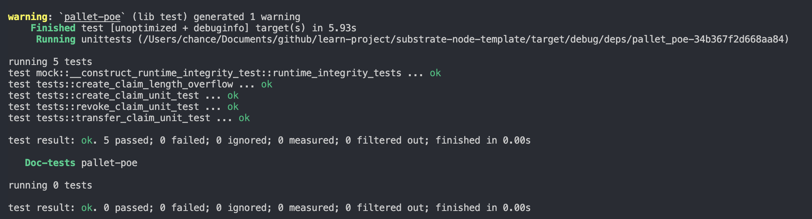

# 第一课作业


## 第一题: 编写存证模块的单元测试代码


### `create_claim_unit_test` 创建存证的测试用例

```rust

#[test]
fn create_claim_unit_test() {
	new_test_ext().execute_with(|| {
		let proof = vec![1u8; 10];
		// should work
		assert_ok!(POE::create_claim(Origin::signed(ALICE), proof.clone()));

		// Event log
		System::assert_has_event(Event::POE(crate::Event::ClaimCreated(ALICE, proof.clone())));

		// check proof value
		assert_eq!(POE::get_proofs(&proof).0, ALICE);
		assert_eq!(POE::get_proofs(&proof).1, 1);

		// failed, ProofAlreadyClaimed
		assert_noop!(
			POE::create_claim(Origin::signed(ALICE), proof),
			Error::<Test>::ProofAlreadyClaimed
		);

		let proof = vec![1u8; 21];

		// failed, ProofLengthOverflow
		assert_noop!(
			POE::create_claim(Origin::signed(ALICE), proof),
			Error::<Test>::ProofLengthOverflow
		);
	});
}

```

### `revoke_claim_unit_test` 撤销存证的测试用例

```rust


#[test]
fn revoke_claim_unit_test() {
	new_test_ext().execute_with(|| {
		let proof = vec![1u8; 10];
		// failed, proof is not existed
		assert_noop!(
			POE::revoke_claim(Origin::signed(ALICE), proof.clone()),
			Error::<Test>::NoSuchProof
		);

		// create_claim
		assert_ok!(POE::create_claim(Origin::signed(ALICE), proof.clone()));

		// failed, wrong origin
		assert_noop!(
			POE::revoke_claim(Origin::signed(BOB), proof.clone()),
			Error::<Test>::NotProofOwner
		);

		// should work
		assert_ok!(POE::revoke_claim(Origin::signed(ALICE), proof.clone()));

		// Event log
		System::assert_has_event(Event::POE(crate::Event::ClaimRevoked(ALICE, proof.clone())));
	});
}

```

### `transfer_claim_unit_test` 转移存证的测试用例

```rust

#[test]
fn transfer_claim_unit_test() {
	new_test_ext().execute_with(|| {
		let proof = vec![1u8; 10];
		// failed, proof is not existed
		assert_noop!(
			POE::transfer_claim(Origin::signed(ALICE), BOB, proof.clone()),
			Error::<Test>::NoSuchProof
		);

		// create_claim
		assert_ok!(POE::create_claim(Origin::signed(ALICE), proof.clone()));

		// failed, wrong origin
		assert_noop!(
			POE::transfer_claim(Origin::signed(BOB), ALICE, proof.clone()),
			Error::<Test>::NotProofOwner
		);

		// should work
		assert_ok!(POE::transfer_claim(Origin::signed(ALICE), BOB, proof.clone()));

		// Event log
		System::assert_has_event(Event::POE(crate::Event::ClaimTransfered(
			ALICE,
			BOB,
			proof.clone(),
		)));
	});
}

```
### 代码运行截图



## 第二题: 创建存证时，为存证内容的哈希值`Vec`, 设置长度上限，超过限制时返回错误

### lib.rs修改

```rust 
#[pallet::config]
pub trait Config: frame_system::Config {
    
    //......

    /// the max length bytes of proof.
    #[pallet::constant]
    type MaxProofLength: Get<u32>;
}

#[pallet::call]
impl<T: Config> Pallet<T> {
    #[pallet::weight(1_000)]
    pub fn create_claim(origin: OriginFor<T>, proof: Vec<u8>) -> DispatchResult {
        
        let sender = ensure_signed(origin)?;
        // 检查存证内容长度是否超过上限
        ensure!(proof.len() <= T::MaxProofLength::get() as usize, Error::<T>::ProofLengthOverflow);

        //.....
    }

    //.....
}
```

### mock.rs修改

```rust

parameter_types! {
	pub const MaxProofLength: u32 = 20;
}

impl pallet_poe::Config for Test {
	type Event = Event;
	type MaxProofLength = MaxProofLength;
}

```

### `create_claim_length_overflow` 检查存证内容长度的单元测试

```rust

#[test]
fn create_claim_length_overflow() {
	new_test_ext().execute_with(|| {
		let proof = vec![1u8; 21];

		// failed, ProofLengthOverflow
		assert_noop!(
			POE::create_claim(Origin::signed(ALICE), proof),
			Error::<Test>::ProofLengthOverflow
		);
	});
}

```

